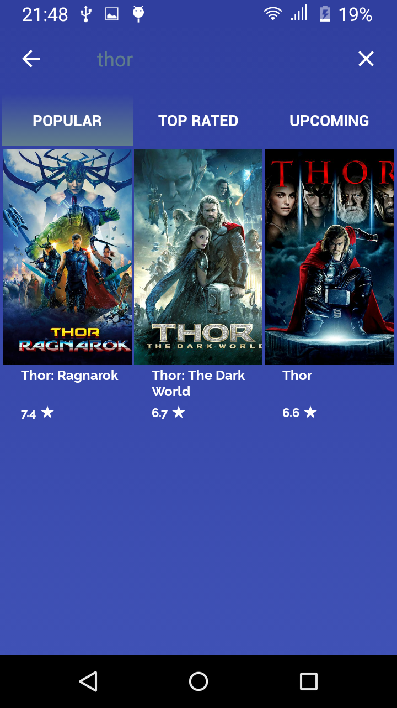

# Looking4Movies (En Desarrollo)

Una aplicación básica de películas y series.

Una aplicación básica de películas y series.
- Consume el API de películas y series de www.themoviedb.org
- Tiene tres categorías de películas y/o series: Popular, Top Rated, Upcoming.
- Cada película y/o series contiene su detalle.
- Buscador de las películas cargadas.

##   Idioma / Bibliotecas / Arquitectura utilizada

1.Kotlin como Idioma - Usado

2.Volley para conexiones http- Implementado

3.Glide para imágenes - Implementado

4.MVC como arquitectura - Seguida

5.SQLite como Base de datos. Para funciones Offline en esta app es mejor usar Realm o Firebase (En progreso)

## Capas de la aplicación

Capa de Modelo de Datos (Model): Esta capa gestiona los datos. Son las clases de la lógica de negocio.

Capa de Presentación o Visualización (View): Se encarga de mostrar los datos. Aquí se encuentran los Fragmentos y Vistas. 

Controladores (Controller): Se sitúa entre el modelo y la vista, permitiendo conectar la interfaz gráfica con los datos.

### En qué consiste el principio de responsabilidad única? Cuál es su propósito?

El principio de Responsabilidad Única consiste en que un objeto debe realizar una única cosa.
Que cada clase tenga una responsabilidad lógicas a la vez

### Qué características tiene, según su opinión, un “buen” código o código limpio?

-Su lectura debe ser fácil de entender. 

-Debe ser simple de cambiar. 

-Debe estar dispuesto para ser testeado con métodos unitarios. 

-Los métodos no deben hacer más de usa cosa. 

-No debe acarrear duplicidad de código. 

-Se debe emplear la menor cantidad de librerías externas.

## Autor

* **Carlos Vivas** 

